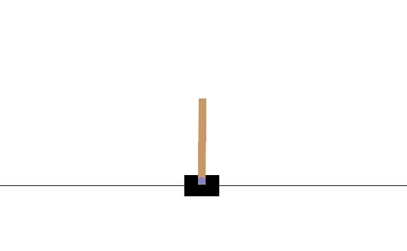

# ppo_pytorch
A simple implementation of the [Proximal Policy Optimization (PPO)](https://arxiv.org/abs/1707.06347) Reinforcement Learning algorithm using Pytorch.

<p align="center">

</p>

## Some features
* A separate file for hyper-parameters for an easy, practical tuning.
* You can stop/resume the training process any time as the trained models are saved after every epoch in the `models` directory.
* [Tensorboard](https://github.com/tensorflow/tensorboard) support: if you have Tensorboard installed, you can run it to track the progress of the training in real-time using:
```bash
tensorboard --logdir runs
```
## How to use
* Clone the repository to a local folder
```bash 
git clone https://github.com/abdeladim-s/ppo_pytorch && cd ppo_pytorch
```
* Install the dependencies
```bash
pip install -r requirements.txt
```
* Run the main file
```bash 
python main.py 
```
This will run the trained agent of the `CartPole-v0` environment (Similar to the image above).

## How to train your own models

* Add your environment to the `config` dictionary inside the `hyper_paramters` file.
This should be a [gymnasium](https://github.com/Farama-Foundation/Gymnasium) (formerly Gym) environment or any subclass of `gymnasium.Env`
```python
config = {
    # ...
    'Pendulum-v1': {
        
    }
}
```
* Override the `defaults` ppo hyper-parameters or create another new set of hyper-parameters.

```python
config = {
    # ...
    'Pendulum-v1': {
        'defaults': {
            'epochs': 100,
        },
        'model-001':{
            "seed": 10,
            "epochs": 25,
            "steps_per_epoch": 1500,
            "max_episode_steps": 100,
            # ...
            "reward_threshold": None
        }
    }
}
```
* Modify the `main` function with the new `env_name` and `model_id`
```python
def main():

    env_name = 'Pendulum-v1'
    model_id = 'model-001'

   # ...
```
_*if no `model_id` was given, the `defaults` parameters will be taken by default._ 

* Run the `main.py` file with `train=True` if you want to train the agent or `train=False` if you want to evaluate the trained model.
```python
def main():

    env_name = 'Pendulum-v1'
    model_id = 'model-001'

    train = True  # for training
    #  train = False  # for evaluation
    if train:
        policy = Policy(env_name, model_id=model_id, render_mode=None)
        policy.train()
    else:
        policy = Policy(env_name, model_id=model_id, render_mode='human')
        policy.evaluate(1)

```

__Note__

* You can test a simple random agent of the environment using the `test_env.py` script.


## license
GPLv3. See `LICENSE` for the full license text.


